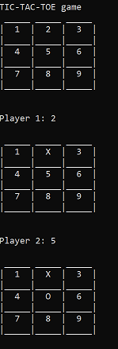

# Learning materials for C++

## Lafore

Examples and exercises from the book *Object-Oriented Programming in C++" by Robert Lafore (4th edition).

## Tic tac toe

Tic tac toe game based on the course on Codecademy.

